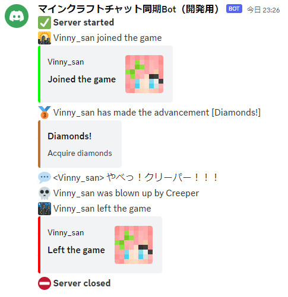
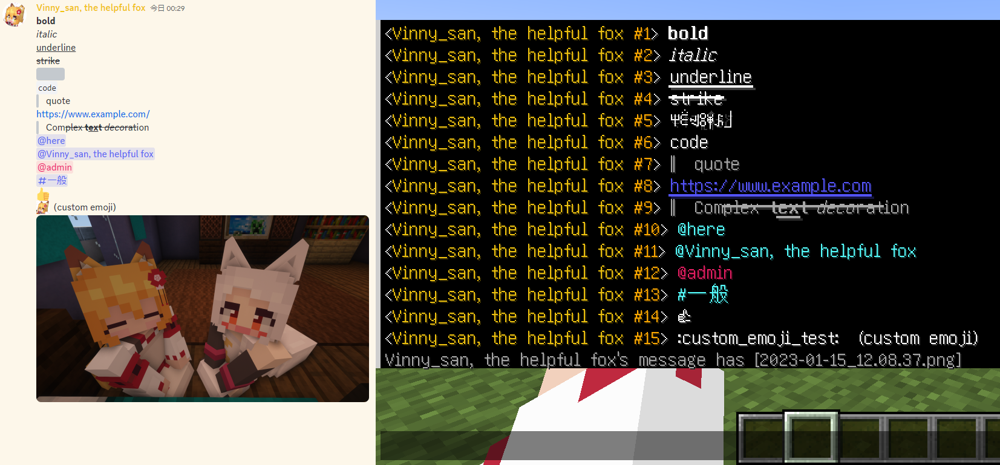
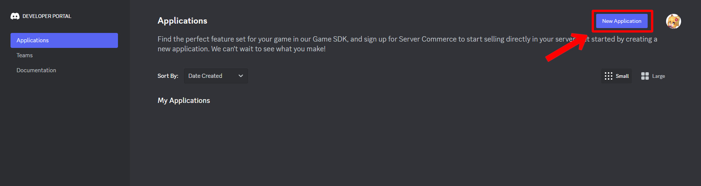
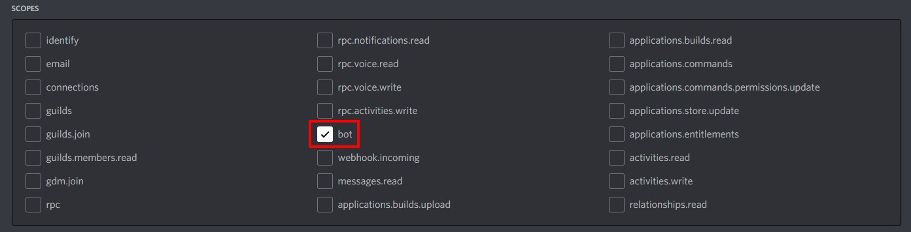

Language: 　**English**　|　[日本語](./README_jp.md)

# Minecraft - Discord Chat Sync
This system synchronizes [Minecraft Java Edition](https://www.minecraft.net/en-us/store/minecraft-java-bedrock-edition-pc) (Bedrock Edition is not supported) in-game chat and [Discord](https://discord.com/) chat. When a message is sent on either side, the same message will be sent to the other side in real time. It makes conversations between Minecraft players and Discord users more seamless.

## Features
- Sends in-game events to Discord channels!
  - Server opened
  - Player joined
  - In-game chat
  - Advancements made
  - Player died
  - Player left
  - Server closed

  

- Sends Discord messages to in-game chat!
  - The sender's name will be its nickname in the Discord server.
  - The sender's display color will be applied (Minecraft 1.16+).
  - Interprets text decorations in Discord messages and apply them to in-game chat.
    - Spoiler tags (`||spoiler||`) in Discord will be obfuscated text in the game. Hover mouse cursor over the text to see the spoiler content.
    - URL (`http(s)://~`) will be clickable texts in the game.
    - If sent Discord messages have attachments, they also will be shown in the game and opened by clicking texts.

  

- Slash commands are supported!
  - "/list": Shows the list of the players which are playing in the server. (This is same as "/list" commands in the game)

- Languages can be applied easily if the language are supported in the game.
  - English and Japanese data are provided first.
  - Please see [here]() for details.

  

## Setup
This sections is currently incomplete.

### 1: Creating Discord bot
This information is current as of June 2023. It might be changed in the future.

A Discord account is required to create Discord bot. If you have not had it yet, please create it. If you have already had your Discord account, you can use it.

1. Access to the [Discord developers portal](https://discord.com/developers/applications).
2. Click "New Application" on the top-right corner in the page.

  

3. Enter the application name (not bot name) in the textbox. Read [Developer Term of Service](https://discord.com/developers/docs/policies-and-agreements/developer-terms-of-service) and [Developer Policy](https://discord.com/developers/docs/policies-and-agreements/developer-policy) and click "create" button.

  

4. Click "Bot" button in the sidebar.
5. Click "Add Bot" button to create bot. A confirmation message will be shown and proceed. A bot will be created if "A wild bot has appeared!" is shown.

  

6. Set bot name and icon in the "Build-A-Bot" section.
7. Click "copy" button to copy token.
   - **Your token is SECRET INFORMATION! Manage your token not to leak to others!**
   - If you suspect that your token has been leaked, please regenerate it as soon as possible.

  

8. Turn on "MESSAGE CONTENT INTENT" in the "Privileged Gateway Intents" section.

  

9. Save changes.
10. Click "OAuth2" → "URL Generator" in the sidebar.
11. Check the "bot" checkbox in the "SCOPES" section and access the URL at the bottom of the page.

  

12. Select the server which you want to add bot and authenticate.
13. Your bot will be added to the selected server.

  

## Enabling Rcon
1. Open game server config (`server.properties`).
2. Set config related Rcon as following.

| Key | Value | Note |
| - | - | - |
| enable-rcon | true | |
| rcon.port | 25575 | Set another value if you cannot set default value. |
| rcon.password | <any string> | Please make sure that the password is hard to guess by others. |

## Launch options
You can set some options when launching this system.

| Option | Description |
| - | - |
| -c | Colors the log to make it easier to read. Not recommended for use when logs are output to file. |
| -d | Outputs debug logs to show more details. |
| -r | Connects Rcon at system launch. Please specify if you start this system after the game server launched. |

## system config
The system config (`config.json`) will be generated after first launch. Please set configs refer to the following.

| Item | Description | Initial value | Valid value |
| - | - | - | - |
| pathToLog | Path to the log file of the game server | ../../logs/latest.log | string (ends with ".log") |
| logCharCode | Character code of the log file | utf-8 | string（[supported character codes](https://github.com/ashtuchkin/iconv-lite/wiki/Supported-Encodings)）|
| locale | The language of this system | en_us | string（same as language name in the game） |
| token | Bot token | | string |
| listenChannels | The list of the channel IDs where this system detects messages from Discord. | [] | string[] |
| sendChannels | The list of the channel IDs where this system sends messages to Discord. | [] | string[] |
| rConPort | Rcon port number | 25575 | number（0 - 65535） |
| rConPassword | Rcon password | | string |
| plugins.discord_message.use_legacy_format | Whether this system use old format or not when sending Discord message to Minecraft. Set `false` if the game version is 1.16 or newer, or `true` if the game version is 1.15.x or older. | false | boolean |

## How to generate locale data
Locale data is stored at `./locales`. Only English and Japanese are provided by default, but you can create locale data by extracting game language data from game resources.

1. Open terminal.
2. Set current directory to `../MinecraftDiscordChatSync/src/locales/locale_generator`.
3. If you haven't installed modules yet, type `npm install` to install modules.
4. Type `ts-node LocaleDataGenerator.ts` to launch tool.
5. Follow the instructions and enter the necessary information to generate locale data.
6. `../<lang_code>/<lang_code>.tsv` is the locale data used by this system. Please open this and translate each key.

## Notes
- If the format of the game is changed by mods or plugins, this system may not work correctly.
- If players have prefix or suffix in their name by "[/team](https://minecraft.fandom.com/wiki/Commands/team)" commands, this system cannot detect events correctly.
- I am not responsible for any damages or troubles caused by the use of this system.
- Please feel free to report any issues or suggestions to [Issues](https://github.com/Gakuto1112/MinecraftDiscordChatSync/issues).