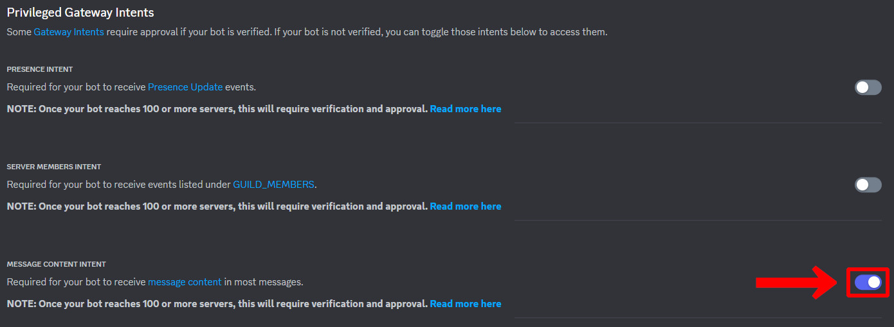

言語：　[English](./README.md)　|　**日本語**

# Minecraft - Discord チャット同期システム
[Minecraft Java Edition](https://www.minecraft.net/ja-jp/store/minecraft-java-bedrock-edition-pc)（Bedrock Edition/統合版非対応）のゲーム内チャットと[Discord](https://discord.com/)のチャットを同期するシステムです。どちらか片方でメッセージを送信するともう片方にもリアルタイムで同じメッセージが送信されます。MinecraftのプレイヤーとDiscordのユーザーとのチャットをよりシームレスなものにします。


## 特徴
- ゲーム内で発生した出来事をDiscordにも送信します。
  - サーバー起動
  - プレイヤー参加
  - ゲーム内のチャット
  - 進捗達成
  - プレイヤー死亡
  - プレイヤー退出
  - サーバー閉鎖

  

- Discordのチャットをゲーム内にも送信します。
  - 送信者名はそのサーバーでの表示名になります。
  - ユーザーのロールカラーを反映します（ゲームバージョン1.16以降）
  - Discordの文字装飾を解釈してゲーム内でも文字装飾を行います。
    - ネタバレタグ（`||ネタバレ||`）はゲーム内では難読化テキストになります。テキストにマウスカーソルを当てることでネタバレの内容を見ることができます。
    - URL（`http(s)://~`）はゲーム内ではクリックすることでそのURLを開くことができます。
  - メッセージに添付ファイルがある場合はその添付ファイルも表示します。ファイル名をクリックするとその添付ファイルを見ることができます。

  

- スラッシュコマンド（Discordのコマンド）に対応しています。
  - 「/list」で現在サーバーに接続しているプレイヤーの一覧を取得します（ゲームの「/list」コマンドと同義です）。

- 追加のmodやプラグインのインストールが一切必要なく、バニラやmodサーバーに対してそのまま使用することができます。

- ゲームが対応している言語であれば、簡単にシステムに適用させることができます。
  - 初期状態では英語と日本語のデータが用意されています。
  - 詳細は[こちら](#言語データの生成について)をご覧下さい。

  

## 環境構築
### 1: Discordのボットの作成
この情報は2023年6月現在の情報です。将来に仕様変更されている可能性があります。

ボットを作成するにはDiscordのアカウントが必要です。もしアカウントを所有していな場合はアカウントを作成して下さい。既にアカウントを所有している場合はそのアカウントで問題ありません。

1. [Discord開発者ポータル](https://discord.com/developers/applications)アクセスします。
2. 右上の「New Application」をクリックします。

  

3. テキストボックスにアプリケーションの名前（ボットの名前ではない）を入力します。[開発者利用規約](https://discord.com/developers/docs/policies-and-agreements/developer-terms-of-service)と[開発者ポリシー](https://discord.com/developers/docs/policies-and-agreements/developer-policy)を読んで「Create」をクリックします。

  

4. サイドバーの「Bot」をクリックします。
5. 「Add Bot」をクリックしてボットを作成します。確認メッセージが表示されるので続行します。緑色の枠で「A wild bot has appeared!」というメッセージが表示されればボットが作成されたことになります。

  

6. 「Build-A-Bot」セクションでボットの名前やアイコンを設定します。
7. トークンから「copy」をクリックしてトークンをメモ帳などに控えておきます。
   - **トークンは機密情報です。絶対に第三者に漏洩しないように管理して下さい。**
   - 万が一トークンの漏洩が疑われた場合は、速やかにトークンの再発行を行って下さい。

  

8. 「Privileged Gateway Intents」から「MESSAGE CONTENT INTENT」をオンにします。

  

9. 変更内容を保存します。
10. サイドバーの「OAuth2」→「URL Generator」をクリックします。
11. 「SCOPES」の欄の「bot」にチェックを入れ、ページ最下部のURLにアクセスします。

  

12. ボットを追加したいサーバーを選択して、認証をします。
13. サーバーにボットが追加されます。

  

### 2: Rconの有効化
1. ゲームサーバーの設定ファイル（`server.properties`）を開きます。
2. Rconの関する項目を以下のように設定します。

| 項目 | 値 | 備考 |
| - | - | - |
| enable-rcon | true | |
| rcon.port | 25575 | デフォルトの値が不都合の場合は別の値を設定して下さい。 |
| rcon.password | <任意の文字列> | 第三者に推測されにくいパスワードにして下さい。 |

### 3: パッケージのインストール
1. [node.js](https://nodejs.org/ja)v20.2.0をインストールします。

これ以降のパッケージのインストール方法は2種類あります。

#### 3-A: npmを用いる方法
2. 以下のようにディレクトリを作成します。
  ```
  Server/
  ├ MinecraftDiscordChatSync/          ← このフォルダを作る
  ├ server.jar                         ← サーバー実行ファイル
  ├ server.properties
  └ ...
  ```

3. ターミナルを開きます。
4. 1.で作成したディレクトリをカレントディレクトリにします。
5. `npm install @gakuto1112/minecraft-discord-chat-sync`と入力してパッケージをインストールします。

#### 3-B: レポジトリを直接ダウンロードする方法
2. このレポジトリをダウンロード又はクローンして下さい。
  - レポジトリのトップページの右上にある緑色の「<> Code」ボタン →  「Download ZIP」からダウンロード出来ます。
3. ダウンロード/クローンしたパッケージを下の例を参考に配置して下さい。
  ```
  Server/
  ├ MinecraftDiscordChatSync/          ← このフォルダを作る
  │ ├ .github/
  │ │ └ ...
  │ ├ src/
  │ │ ├ MinecraftDiscordChatSync.ts
  │ │ └ ...
  │ ├ .gitignore
  | ├ package-lock.json
  | ├ package-lock.json
  | └ tsconfig.json
  ├ server.jar                         ← サーバー実行ファイル
  ├ server.properties
  └ ...
  ```

4. ターミナルを開きます。
5. カレントディレクトリを`.../MinecraftDiscordChatSync/`にします。
6. `npm install`と入力し、依存モジュールをインストールします。
7. `npm run build`と入力し、コンパイル済みソースコードを生成します。

### 4: システムの起動と設定
1. ターミナルを開きます。
2. カレントディレクトリを`.../MinecraftDiscordChatSync/`にします。
3. `npx minecraft-discord-chat-sync`（[3-A](#3-a-npmを用いる方法)を用いた場合）又は`npm start`（[3-B](#3-b-レポジトリを直接ダウンロードする方法)を用いた場合）と入力し、システムを起動します。
4. 初回起動時はシステム設定ファイル（`config.json`）が生成され、そのまま終了します。
5. [こちら](#システム設定について)を参考にシステムの設定を完了して下さい。
6. 再び3.を実行してシステムを起動します。設定に問題がなければ、ボットにログインします。`Succeeded to login as "<bot_name>#0000".`と表示されれば正常にログイン出来ています。
   - 設定に問題があればその旨が指摘されます。修正の上、システムを再起動して下さい。

## 起動オプションについて
システム起動時にオプションを指定出来ます。
```
ts-node MinecraftDiscordChatSync.ts <オプション1> <オプション2> ...
```

| オプション | 説明 |
| - | - |
| -c | ログに色を付けて見やすくします。ログをファイルに出力する場合の使用は推奨されません。 |
| -d | デバッグログを出力し、より詳細なログを出力します。 |
| -r | システム起動時にRconに接続します。サーバー起動後にシステム起動する場合に指定して下さい。 |

## システム設定について
システム初回起動時にシステム設定ファイル（`config.json`）が生成されます。生成後は以下を参考にシステム設定を行って下さい。

| 項目 | 説明 | 初期値 | 有効な設定値 |
| - | - | - | - |
| pathToLog | ゲームサーバーのログファイルまでの相対パス | ../../logs/latest.log | string（「.log」で終了すること） |
| logCharCode | ログファイルの文字コード。Windowsの日本語環境の場合は「shift-jis」に設定するとよい。 | utf-8 | string（[サポートされている文字コード](https://github.com/ashtuchkin/iconv-lite/wiki/Supported-Encodings)）|
| locale | システムの使用言語 | en_us | string（ゲームの言語コードと同じ） |
| token | ボットのトークン | | string |
| listenChannels | システムがDiscordからのメッセージを検出するチャンネルのIDの一覧 | [] | string[] |
| sendChannels | システムがDiscordにメッセージを送信するチャンネルのIDの一覧 | [] | string[] |
| rConPort | Rconのポート番号 | 25575 | number（0 - 65535） |
| rConPassword | Rconのパスワード | | string |
| plugins.discord_message.use_legacy_format | Discordのメッセージをゲームに送信する時に、古いコマンドフォーマットを使用するかどうか。ゲームバージョンが1.16以上の場合は`false`、1.15.x以前の場合は`true`にして下さい。 | false | boolean |

## チャンネルIDの取得方法
1. Discordの設定から「詳細設定」→「開発者モード」をオンにします。
2. サーバーのチャンネル一覧からチャンネルを右クリックして「チャンネルIDをコピー」をクリックします。

## 言語データの生成について
`./locales`にシステムで使用する言語データが保存されています。初期状態では英語と日本語のみが用意されていますが、ゲームが対応している言語であればそこからデータを抽出して言語データを作成することが出来ます。

1. ターミナルを開きます。
2. カレントディレクトリを`.../MinecraftDiscordChatSync/`にします。
3. `npx generate-locale`（[3-A](#3-a-npmを用いる方法)を用いた場合）又は`npm run generate_locale`（[3-B](#3-b-レポジトリを直接ダウンロードする方法)を用いた場合）と入力し、ツールを起動します。
4. 指示に従って必要な情報を入力すると言語データが生成されます。
5. `.../MinecraftDiscordChatSync/locales/<言語コード>/<言語コード>.tsv`はシステムが直接使用する言語データです。これを開いて各項目を翻訳して下さい。

[**注意**]
- 言語データを作成するには**ゲームをインストールして一度起動する**必要があります。
- 言語データ生成ツールはバニラ用です。modの翻訳を追加したい場合は手動で追加する必要があります。

## 注意事項
- modやプラグインによって出力されるログのフォーマットが変更されている場合は正常に動作しない可能性があります。
- 「[/team](https://minecraft.fandom.com/wiki/Commands/team)」コマンドでプレイヤーに接頭語や接尾語が付与されている場合、システムは正常に検出できなくなります。
- このアプリケーションを使用して発生したいかなる損害の責任は負いかねます。
- 不具合や提案がありましたら、お気軽に[Issues](https://github.com/Gakuto1112/MinecraftDiscordChatSync/issues)へご報告ください。