# MinecraftDiscordチャット同期Botアプリケーション
Minecraft（Java Edition）と[Discord](https://discord.com/)のチャットを同期するボットのアプリケーションです。ゲームに参加していないプレイヤーもDiscordを通じてゲーム内プレイヤーと会話できます。サーバーにはModやプラグインは必要なく、バニラサーバーやForgeサーバーにそのまま使用できます。

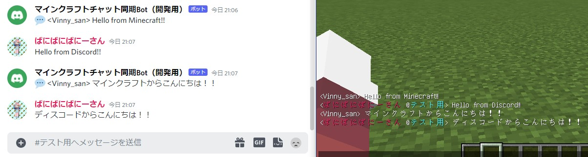)

## 目次
1. [機能紹介](#機能紹介)
2. [ボットアカウントの作成方法](#ボットアカウントの作成方法)
3. [使用方法](#使用方法)
4. [オプションについて](#オプションについて)
5. [MODサーバーでの使用について](#MODサーバーでの使用について)
6. [注意事項](#注意事項)

## 機能紹介
### Minecraft → Discord
MinecraftからDiscordへは以下のものが送信されます。
- プレイヤーのチャット
- サーバー起動のお知らせ
- サーバー閉鎖のお知らせ
- プレイヤー参加のお知らせ
  - 埋め込みメッセージ付き（設定で非表示可）
- プレイヤー退出のお知らせ
  - 埋め込みメッセージ付き（設定で非表示可）
- 進捗達成のお知らせ
  - 埋め込みメッセージ付き（設定で非表示可）
- プレイヤー死亡のお知らせ

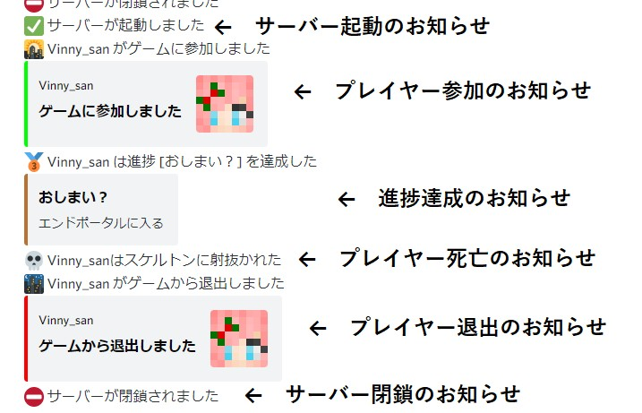

### Discord → Minecraft

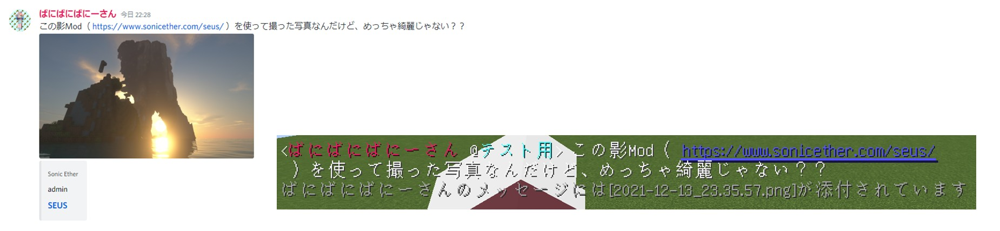
- 指定されたチャンネルにメッセージが送信された時に、ゲーム内にも同様のメッセージが送信されます。
- 名前はサーバーでの表示名になります。カーソルを合わせるとユーザーのタグが表示されます。
  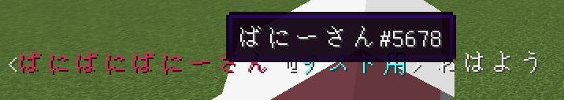

- 名前の色はユーザーのロールカラーになります（1.16～、設定で無効化可）。
- ユーザーが発言したチャンネル名が表示されます（設定で非表示可、非表示にした場合は、カーソルを合わるとユーザータグと共に表示されます）。
- メッセージにURLが含まれている場合は、クリックしてURLにアクセスできる状態になります。
- メッセージに添付ファイルが存在する場合は、添付ファイルも表示できます（設定で非表示可）。

### サーバー管理者向け

- サーバーにModやプラグインを導入する必要はありません。そのままのバニラサーバー、Modサーバーで使用できます。
- 設定で一部機能を無効にできます。
- このアプリケーションはプラグインベースで設計しているので、既存の機能を削除したり、新たな機能を追加できます。

## ボットアカウントの作成方法
1. [Discord](https://discord.com/)のアカウントを用意します。普段使用しているアカウントで構いません。Discordアカウントを持っていない場合は新規作成して下さい。ここでは、Discordアカウントの作成方法は割愛させて頂きます。
2. [Discord開発者ポータル](https://discord.com/developers/applications)にアクセスします。
3. ページ右上の「New Application」をクリックします。
  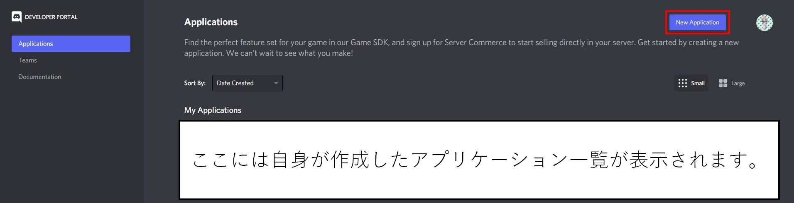
4. アプリケーションの名前（ボットの名前は後程入力します）を入力し、[利用規約](https://discord.com/developers/docs/legal)を読んだ上で続行します。
  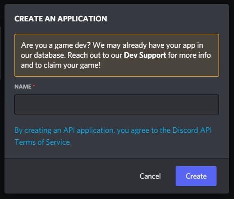)
5. 「General Information」タブでアプリケーションの基本情報を入力します。
   - ここでアップロードする画像はボットのアイコン画像ではありません。
   - 説明欄にボットの説明文を入力するとボットアカウントのプロフィールに表示されます。
  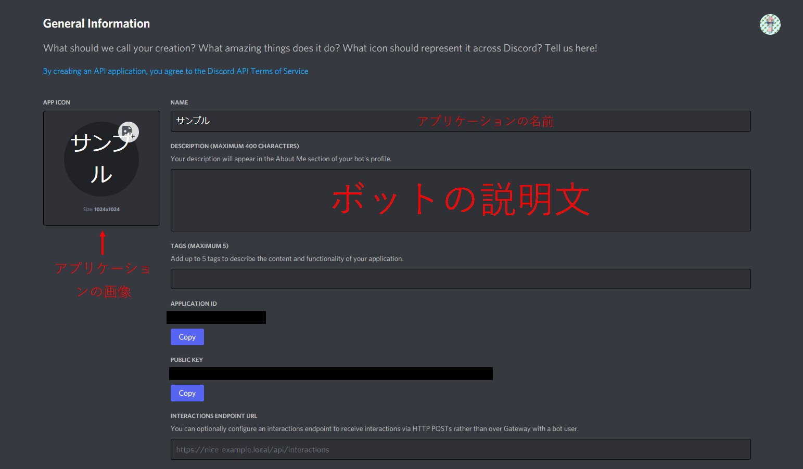
6. 「Bot」タブに移動し、「Add Bot」をクリックしてボットを作成します。確認メッセージが表示されるので続行します。緑色の枠で「A wild bot has appeared!」というメッセージが表示されればボットが作成されたことになります。
  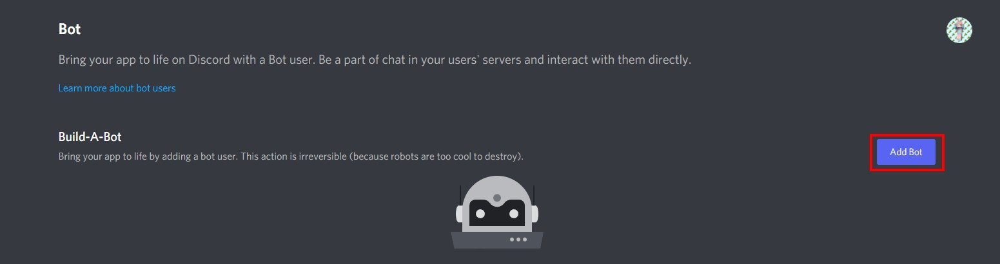
7. ボットの名前とアイコンを入力します。ボットの名前はデフォルトでアプリケーションの名前になります。
  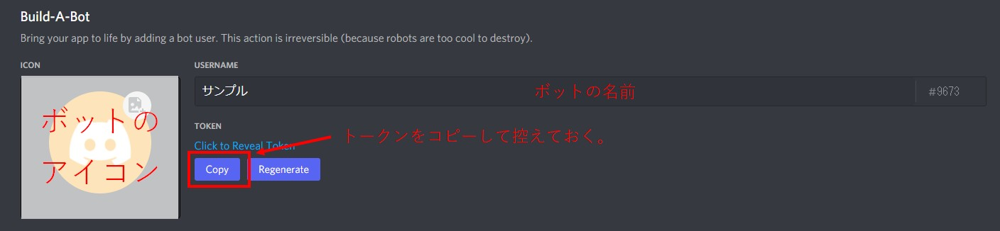
8. 下にスクロールして「PUBLIC BOT」をオフに、「MESSAGE CONTENT INTENT」をオンにします。
   - 「PRESENCE INTENT」と「SERVER MEMBERS INTENT」はアプリケーションの機能拡張した場合は、必要に応じてオンにして下さい。オンでも支障はありません。
  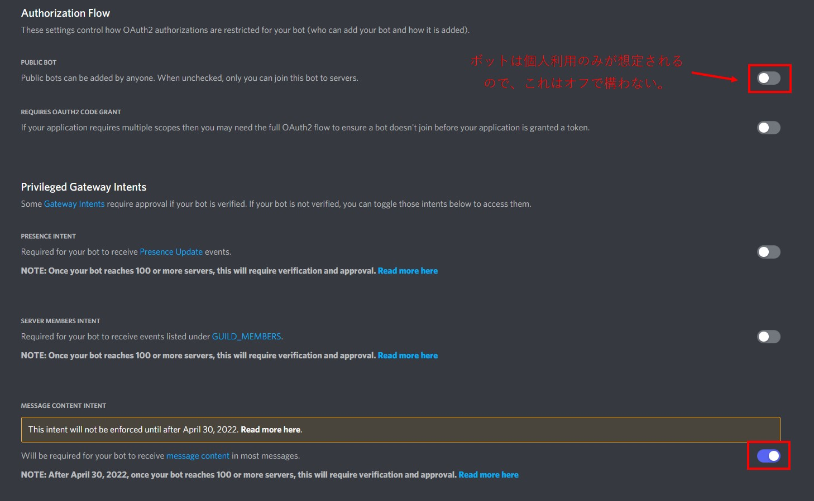
9. トークンをコピーして控えておきます。 **トークンは第三者に漏洩しないように厳重に扱って下さい。** トークンが漏洩したと思われる場合はトークンを再生成して下さい。
10. 設定の変更を保存します。
11. 「OAuth2」の「URL Generator」タブに移動し、「SCOPES」の欄の「bot」にチェックを入れ、ページ最下部のURLにアクセスします。
  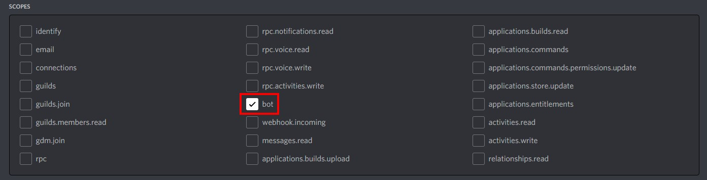
12. ボットを追加したいサーバーを選択して、認証をします。
13. サーバーにボットが追加されます。
  

## 使用方法
1. このアプリケーションを実行するには「Node.js（v16.13.1[^1]）」が必要です。[こちら](https://nodejs.org/ja/)からインストールして下さい。
2. このアプリケーションのデータをダウンロードします。このページ上部の緑色の「**Code**」から「**Download ZIP**」をクリックするとzipファイルをダウンロードできます。また、このレポジトリをクローンしてもダウンロードできます（gitユーザー向け）。
   - データの保存先は、「**該当のサーバーの実行ファイルが存在するディレクトリに新たなフォルダを作ってその中に保存する**」のが好ましいです。
```
（ディレクトリ構造の例）
Server/
  ├ MinecraftDiscordChatSync/     ←このフォルダを作る
  │ ├ plugins/
  │ │ └ ...
  │ ├ .gitignore
  | ├ MinecraftDiscordChatSync.ts     ←このアプリケーションのメインソースファイル
  | ├ README.md
  | ├ package-lock.json
  | └ package.json
  ├ server.jar      ←サーバー実行ファイル
  ├ server.properties
  └ ...
```
3. Windowsなら「コマンドプロンプト」または「Power Shell」を、MacOSなら「ターミナル」を開きます。
4. 以下のコマンドで、アプリケーションのディレクトリまで移動します。
   - ディレクトリまでのパスはお使いの環境に合わせて変更して下さい。
```
cd C:\..\Server\MinecraftDiscordChatSync\
```
5. 以下のコマンドを1つずつ入力して必要なモジュールをインストールします。
```
npm install
```
なお、使用しているモジュールは以下の通りです。

| モジュール名 | バージョン[^1] |
| --- | --- |
| [chokidar](https://www.npmjs.com/package/chokidar) | 3.5.2 |
| [discord.js](https://www.npmjs.com/package/discord.js) | 13.5.0 |
| [iconv](https://www.npmjs.com/package/iconv) | 3.0.1 |
| [rcon-client](https://www.npmjs.com/package/rcon-client) | 4.2.3 |

6. 以下のコマンドを入力してアプリケーションを実行します。
```
ts-node MinecraftDiscordChatSync.ts
```
7. 初期起動時は以下のようなメッセージが表示されます。
```
設定ファイル「Settings.json」が存在しません。
「Settings.json」を生成しました。ファイルを開いて必要な情報を入力して下さい。
```
初期生成される「Settings.json」（以下、設定ファイル）は以下のようになっています。
```json
  {
    "minecraftVersion": "1.19",
    "pathToLogFile": "../logs/latest.log",
    "logEncode": "utf-8",
    "timeOffset": 9,
    "embeds": {
        "advancements": true,
        "playerJoin": true,
        "playerLeave": true
    },
    "rconPort": 25575,
    "rconPassword": "",
    "token": "<Botのトークン>",
    "botSendChannels": [
        "<チャンネルID>"
    ],
    "botWatchChannels": [
        "<チャンネルID>"
    ],
    "discordMessageDisplay": {
        "ignoreBots": true,
        "displayRoleColor": true,
        "showChannelName": true,
        "useRichText": true,
        "showAttachments": true
    }
}
  ```

8. 生成された設定ファイルを編集して必要な情報を設定します。

| 項目 | 説明 | 初期値 | 有効な設定値 |
| --- | --- | --- | --- |
| minecraftVersion | 実行するマインクラフトサーバーのバージョンです。設定されたバージョンによって、Rconで送信されるコマンドが変化します。希望のバージョンが存在しない場合は、最寄りのバージョンを選択してください（正しく動作しない場合があります）。 | 1.19 | string（1.12 ~ 1.19.2のリリースバージョン）
| pathToLogFile | カレントディレクトリから見た「latest.log」までのパスを設定して下さい。 | ./logs/latest.log | string |
| logEncode | ログファイルの文字コード。Windowsの場合、非ASCII文字が文字化けする場合があります。その場合は「shift-jis」に変更してみて下さい。 | utf-8 | string（「utf-8」か「shift-jis」のいずれか） |
| timeOffset | 世界標準時（GMT）から見た時差（時）。日本で使用する場合は変更不要です。 | 9 | number |
| embeds | ボットの各メッセージで埋め込みメッセージを表示するかのどうかの設定です。falseの場合は埋め込みメッセージは表示されません。詳細は下記を見て下さい。 | | |
| rconPort | Rconのポート番号です。サーバーと同じ設定にして下さい。 | 25575 | number（0~65535） |
| rconPassword | Rconのパスワードです。サーバーと同じ設定にして下さい。 | | string |
| token | ボットのトークン。 | | string |
| botSendChannels | ボットがメッセージを送信するチャンネルです。設定するチャンネルIDを列挙して下さい。 | | string[]（数字以外の文字はエラーになります。） |
| botWatchChannels | ゲーム内にDiscordのメッセージを送信する対象のチャンネルです。設定するチャンネルIDを列挙して下さい。 | | string[]（数字以外の文字はエラーになります。） |
| discordMessageDisplay | Discordからゲーム内へメッセージを送信する際の各種設定です。詳細は下記を見て下さい。 | | |

**embeds**

| 項目 | 説明 | 初期値 | 有効な設定値 |
| --- | --- | --- | --- |
| advancements | 進捗達成時のメッセージに埋め込みメッセージを表示するかどうかです。 | true | boolean |
| playerJoin | プレイヤー参加時のメッセージに埋め込みメッセージを表示するかどうかです。 | true | boolean |
| advancements | プレイヤー退出時のメッセージに埋め込みメッセージを表示するかどうかです。 | true | boolean |

**discordMessageDisplay**

| 項目 | 説明 | 初期値 | 有効な設定値 |
| --- | --- | --- | --- |
| ignoreBots | 他のボットのメッセージを無視するかどうかです。trueにすると他のボットのメッセージをゲーム内に表示しません。falseにしても自身のメッセージは無視します。 | true | boolean |
| displayRoleColor | Discordからのメッセージでユーザー名の色をロールカラーにするかどうかです。初期カラーは白色になります。falseかバージョンが1.16以前の場合は黄色になります。 | true | boolean |
| showChannelName | ユーザー名と共にチャンネル名が表示されるかどうかです。trueにするとユーザー名と共に発言元のチャンネル名が表示されます。 | true | boolean |
| useRichText | Discordのメッセージをアプリケーションが解釈して文字装飾するかどうかです。trueにすると、太字、イタリック、スポイラー、URLなどが文字装飾されてゲーム内に表示されます。 | true | boolean |
| showAttachments | 添付ファイルのメッセージをゲーム内に表示するかどうかです。trueにするとDiscordの添付ファイルへのリンクをゲーム内に表示します。 | true | boolean |

9. 設定ファイルを上書き保存し、アプリケーションを再度実行します。設定が正しい場合は、```<ボットアカウントの名前>#0000 でログインしました。```と表示されます。設定に不正がある場合は、その旨が指摘されます。修正してアプリケーションを再度実行して下さい。
10. サーバーを実行します。
11. アプリケーションを終了する場合は、「Ctrl+c」を押すか、ウィンドウを閉じて下さい。

### バッチファイルによるコマンドを入力の省略
以下のようなバッチファイルをアプリケーションフォルダーに作成しておくことで、アプリケーション実行時にダブルクリックで簡単に実行することができます。以下の例はWindowsの場合です。
```
@echo off
ts-node MinecraftDiscordChatSync.ts
pause
```

## オプションについて
実行時に引数にしてできるオプションがあります。
```
ts-node MinecraftDiscordChatSync.ts <オプション1> <オプション2> ...
```

### 「-r」オプション
即座にRcon接続が開始されるオプションです。既にサーバーを起動した場合に使用して下さい。

### 「-e」オプション
エラー発生時にスタックトレースを表示します。デバッグ等にお使いください。

## MODサーバーでの使用について
```./plugins/data/```には、英語名と日本語名を関連付ける各種ファイルがあります。ファイルの内容はファイル名から想像できる通りです。

| ファイル名 | 内容 |
| --- | --- |
| advancements.tsv | 進捗の名前と説明文 |
| death.tsv | 死亡メッセージ |
| entity.tsv | エンティティ名（モブ含む） |

MODで進捗やエンティティや死亡メッセージが追加された場合は、これらのファイルに追記することで、MODで追加されたものも日本語で表示されるようになります。

## 注意事項
ファイルをダウンロードした時点で以下の注意事項に同意したものとみなします。
- このアプリケーションを使用して発生したいかなる損害の責任は負いかねます。
- このアプリケーションは、参加サーバー数が100を超えるボットには使用できません。
- 不具合や提案がありましたら、お気軽に[Issues](https://github.com/Gakuto1112/MinecraftDiscordChatSync/issues)へご報告ください。

[^1]: バージョンは開発時に使用したバージョンを表示しています。表示されているバージョンでなくても動作する場合もあります。